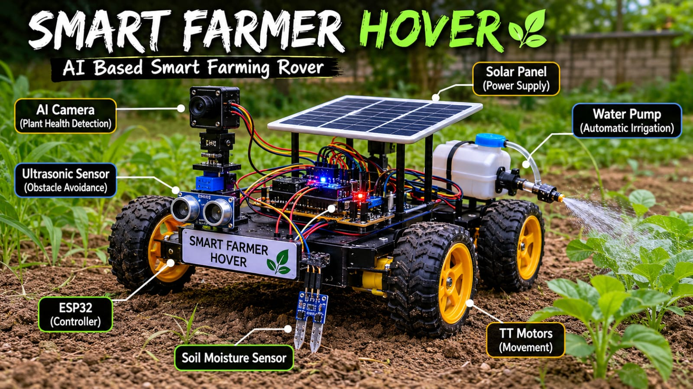
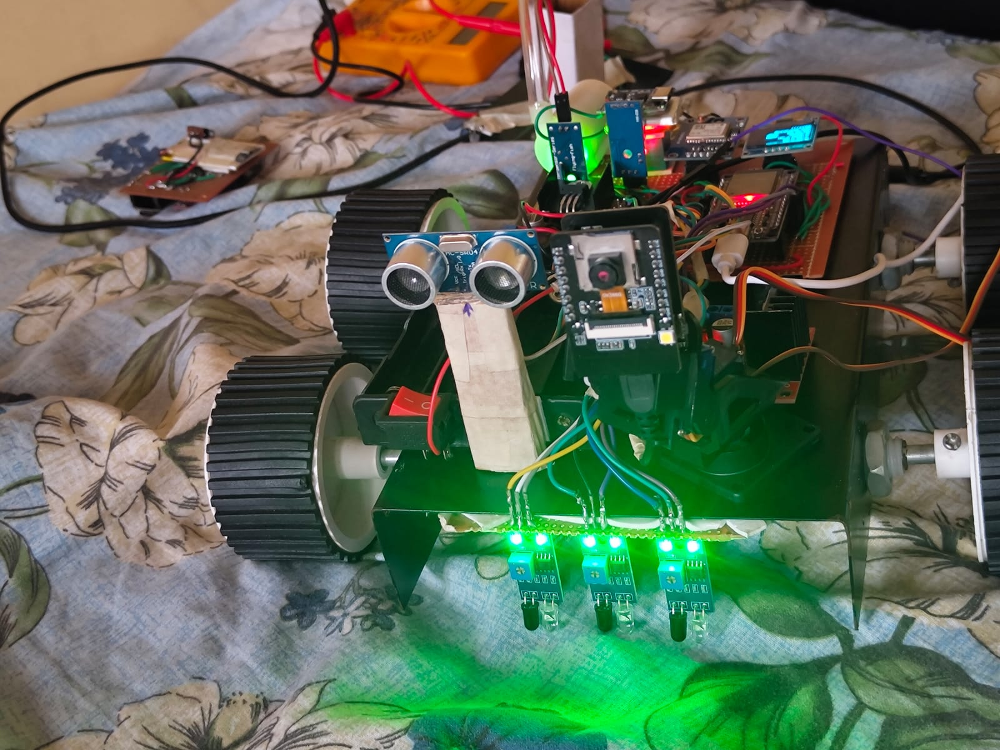
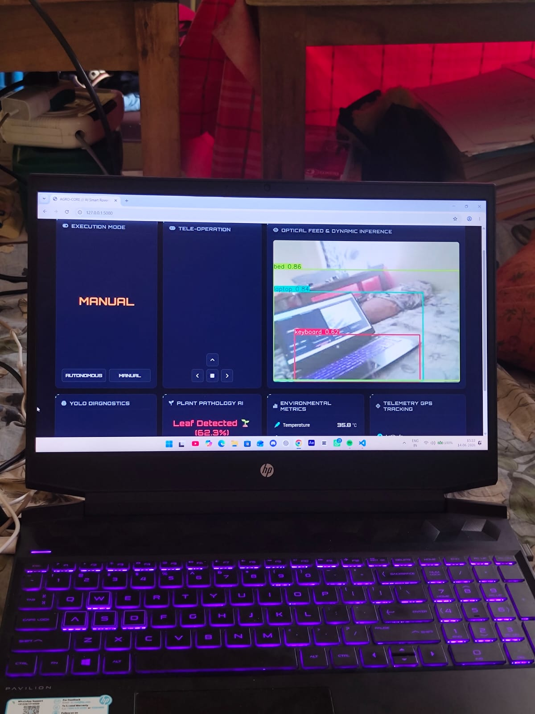
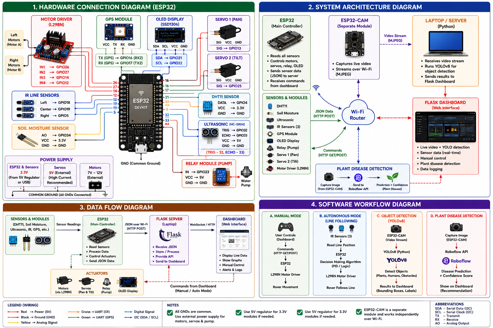

# AGRO-VATORS

<p align="center">
  <b>AI-powered Smart Farming Rover for Plant Disease Detection, Autonomous Navigation, and Real-time IoT Monitoring</b>
</p>

<p align="center">
  
</p>
<p align="center">


</p>

# 🚜 AGRO-VATORS

**AI-Powered Smart Farming Rover using Computer Vision and IoT**

AGRO-VATORS is an intelligent farming rover designed to assist farmers by monitoring environmental conditions, detecting plant diseases, and supporting autonomous navigation. It combines IoT sensors, computer vision, and a web dashboard for real-time monitoring and control.

---

## Features

- 🌱 Plant disease detection using YOLOv8 and Roboflow
- 📹 Live ESP32-CAM video streaming
- 🌡️ Real-time temperature and humidity monitoring
- 💧 Soil moisture monitoring
- 🚰 Water pump control using relay
- 📍 GPS location tracking
- 🤖 Autonomous line-following mode
- 🎮 Manual rover control through a web dashboard
- Live dashboard with sensor data

---

##  Hardware Used


| Component | Purpose |
|-----------|---------|
| ESP32 | Main Controller |
| ESP32-CAM | Live Video Streaming |
| L298N Motor Driver | Drive DC Motors |
| DC Motors | Rover Movement |
| DHT11 | Temperature & Humidity |
| Soil Moisture Sensor | Soil Monitoring |
| Ultrasonic Sensor | Obstacle Detection |
| GPS Module | Location Tracking |
| OLED Display | Live Status Display |
| Relay Module | Water Pump Switching |
| Water Pump | Irrigation |
| Servo Motors | Camera Pan & Tilt |

---
---

## Software Stack


| Category | Technologies |
|----------|--------------|
| Programming Language | Python, C++ (Arduino) |
| Backend | Flask |
| Frontend | HTML, CSS, JavaScript |
| AI Model | YOLOv8 |
| Plant Disease Detection | Roboflow API |
| Microcontroller | ESP32, ESP32-CAM |
| IDE | Arduino IDE, VS Code |

---

---

## 📂 Project Structure

```text
AGRO-VATORS/
│
├── docs/
│   ├── diagrams/
│   ├── images/
│   └── videos/
│
├── esp32/
│
├── models/
│
├── static/
│
├── templates/
│
├── test/
│
├── app.py
├── plant_health.py
├── requirements.txt
├── README.md
├── LICENSE
├── .gitignore
└── .env.example
```

---

---

##  Installation

1. Clone the repository

```bash
git clone https://github.com/shayak-98/AGRO-VATORS.git
```

2. Install dependencies

```bash
pip install -r requirements.txt
```

3. Create a `.env` file

```
ROBOFLOW_API_KEY=YOUR_API_KEY
ROBOFLOW_MODEL_ID=YOUR_MODEL_ID
```

4. Run the application

```bash
python app.py
```

---

## 📸 Project Images

### Rover



---

### Dashboard



---

### OLED Display


---
## System Architecture



### Workflow

1. ESP32 collects data from environmental sensors.
2. Sensor data is sent to the Flask dashboard over Wi-Fi.
3. ESP32-CAM streams live video to the Flask application.
4. YOLOv8 performs real-time object detection on the video stream.
5. When the user clicks **Scan Plant**, an image is captured and sent to the Roboflow API.
6. The disease prediction is displayed on the dashboard.
7. The rover can be controlled manually or switched to autonomous mode.

---
---
## Demo

Demo videos of the project are available in:

- `docs/videos/autonomous_mode.mp4`
- `docs/videos/project_demo.mp4`
- `docs/videos/dashboard_demo.mp4`

---
# Usage

1. Power the ESP32 rover.
2. Connect the laptop ,ESP32 and ESP32 CAM  to the same Wi-Fi network.
3. Launch the Flask application.
4. Open the dashboard in your browser.
5. View live sensor data.
6. Watch the ESP32-CAM live stream.
7. Control the rover manually or switch to autonomous mode.
8. Click **Scan Plant** to detect plant diseases.
---
---
# Future Improvements

-  Automatic crop recommendation
- AI-based autonomous navigation
- Cloud database integration
- Android application
- Historical sensor analytics

---
---
# 🤝 Contributing

Contributions, suggestions, and improvements are welcome.

If you find any issues, please open an Issue or submit a Pull Request.

---
---
## 📄 License

This project is licensed under the MIT License.

